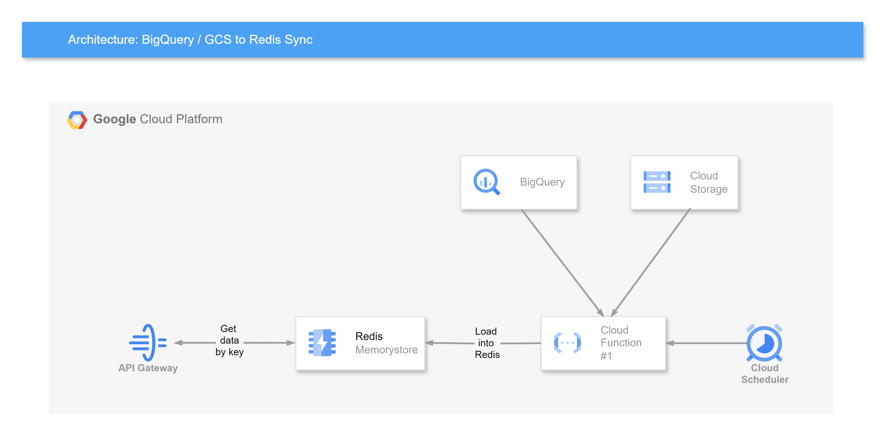

# 🌟 HeliosSync: Illuminate Your Data Pipelines with Seamless Synchronization 🌟

HeliosSync is a Java-based Cloud Function designed to synchronize data from Google BigQuery or Google Cloud Storage (GCS) to a Redis database. This tool allows for daily synchronization and is highly configurable, making it easy to adapt to various data sources and requirements.

## Features 🚀

- **Configurable**: Set up environment variables to customize the data source and Redis configuration. 🛠️
- **Support for BigQuery and GCS**: Load data from Google BigQuery or GCS and push it to Redis. 🌐
- **Logging**: Integrated with Log4j for robust logging. 📝
- **Modular Design**: Utilizes a parent-child class architecture for maintainability and extensibility. 🔧

## Prerequisites 📋

- **Google Cloud Account**: Set up Google Cloud Storage and/or BigQuery. ☁️
- **Redis Server**: Accessible Redis instance. 🔴
- **Java 11**: The project uses Java 11 for development. ☕
- **Maven**: For building the project. 🔨

## Setup and Configuration ⚙️

1. **Clone the Repository**

    ```bash
    git clone https://github.com/kavindaperera/HeliosSync.git
    cd helios-sync
    ```
2. **Deployment View**

Below is the deployment view of the HeliosSync :

    

2. **Configures**

The configuration is stored in `redisson-config.yml` for Redis and a separate `config.properties` for application-specific settings. 
Both files should be placed in the src/main/resources directory of your project.

`config.properties`

This file includes settings and other application configurations.

```
redisson.address=redis://10.0.0.3:6379
redisson.password=
bigquery.project.id=first-smithy-431916-t1
bigquery.query=SELECT cust_id, account_no, key_indicator FROM `first-smithy-431916-t1.helios.customer` LIMIT 1000
```

4. **Build the Project**

    Use Maven to build the project:

    ```bash
    mvn clean package
    ```

5. **Deploy the Cloud Function**

    Deploy the Cloud Function using the Google Cloud CLI:

    ```bash
    gcloud functions deploy HeliosSync \
        --entry-point com.nova.HeliosSync \
        --runtime java11 \
        --trigger-http \
        --allow-unauthenticated \
        --region YOUR_REGION
    ```

## Usage 📤

The Cloud Function can be triggered via HTTP requests. The `Trigger` header determines which data source to use:

- **Trigger with BigQuery**:

    ```bash
    curl -X GET https://REGION-PROJECT_ID.cloudfunctions.net/HeliosSync \
        -H "Trigger: BigQuery"
    ```

- **Trigger with GCS**:

    ```bash
    curl -X GET https://REGION-PROJECT_ID.cloudfunctions.net/HeliosSync \
        -H "Trigger: GCS"
    ```

## Testing 🧪

Unit tests are provided to ensure the functionality of the core components. Use Maven to run the tests:

```bash
mvn test
